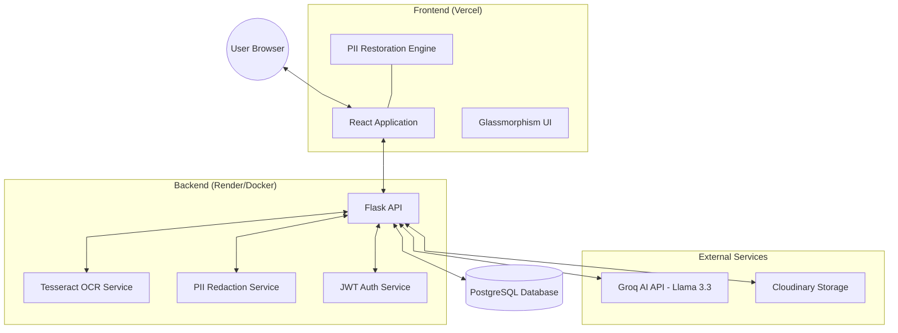
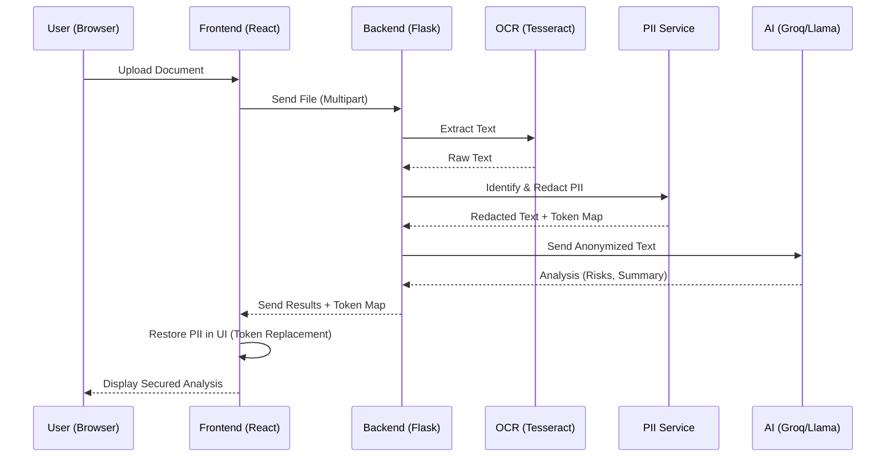
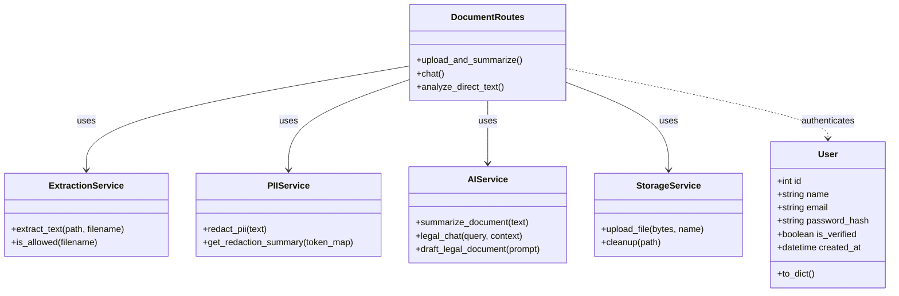
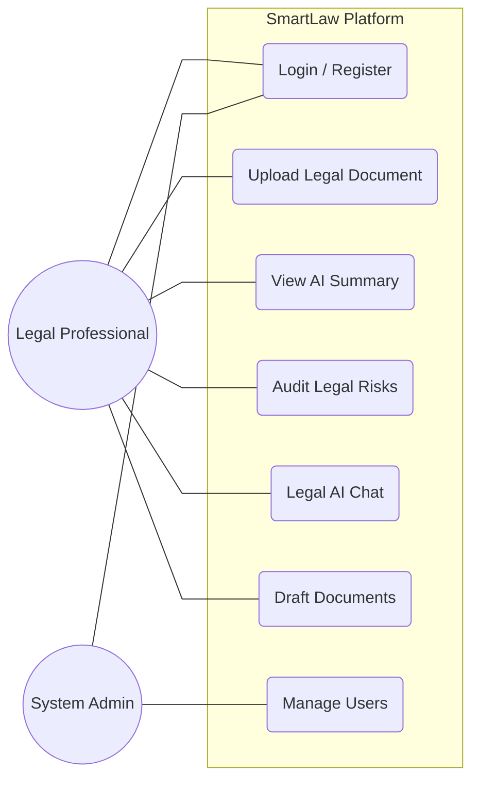
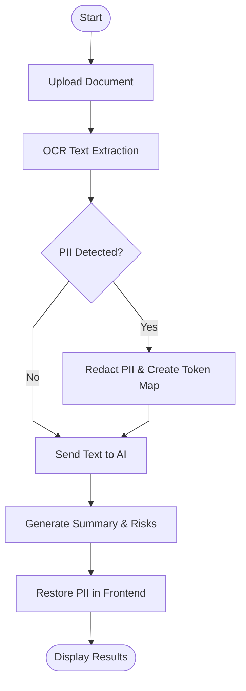

# Real-time/Field-Based Research Project Report On
# SmartLaw: Legal Summarizer and AI ChatBot

A dissertation submitted to the Jawaharlal Nehru Technological University, Hyderabad in partial fulfillment of the requirement for the award of a degree of

**BACHELOR OF TECHNOLOGY IN**
**COMPUTER SCIENCE AND ENGINEERING**

Submitted by

Thokala Vijaya Lakshmi (24B81A05R6)
Thipparthi Srija Reddy (24B81A05Q5)
Pakker Sanjana Reddy(24B81A05P4)
Under the Guidance of
Ms. G. Sushma
Sr.Assistant Professor,
**Department of Computer Science and Engineering**
**CVR COLLEGE OF ENGINEERING**
(An UGC Autonomous Institution, Affiliated to JNTUH, Accredited by NBA, and NAAC)
Vastunagar, Mangalpalli (V), Ibrahimpatnam (M), Ranga Reddy (Dist.) - 501510, Telangana State.

---

## CERTIFICATE

This is to certify that the project work entitled **"SmartLaw: Legal Summarizer and AI ChatBot"** is being submitted by Thokala Vijaya Lakshmi, Thipparthi Srija Reddy and Pakker Sanjana Reddy in partial fulfillment of the requirement for the award of the degree of Bachelor of Technology in Computer Science and Engineering, during the academic year 2025-2026.

**Professor-in-charge RFP**  
**Professor and Head, CSE (Dr. A. Vani Vathsala)**

---

## DECLARATION

I hereby declare that this project report titled **"SmartLaw: Legal Summarizer and AI ChatBot"** submitted to the Department of Computer Science and Engineering, CVR College of Engineering, is a record of original work done by me. The information and data given in the report is authentic to the best of my knowledge. This Real Time/Field-Based Research Project report is not submitted to any other university or institution for the award of any degree or diploma or published at any time before.

**Date:**  
**Place:**

< Student Name- Hall Ticket Number >  
< Student Name- Hall Ticket Number >  
< Student Name- Hall Ticket Number >

---

## ABSTRACT

SmartLaw is a secure, privacy-first legal document management and analysis platform designed to bridge the gap between AI capabilities and legal confidentiality. While large language models (LLMs) offer transformative potential for legal professionals, they pose significant risks regarding the exposure of Personally Identifiable Information (PII). SmartLaw solves this through a custom "Anonymized Inference" pipeline that redacts sensitive identifiers (like PAN and Aadhaar numbers) before data reaches third-party AI providers, and restores them only in the user's browser. The platform provides automated document summarization, risk auditing with page-level citations, and a context-aware legal chatbot. Built with a distributed architecture using React, Flask, and Docker, SmartLaw demonstrates a production-grade solution for sensitive document intelligence in the legal domain.

---

## TABLE OF CONTENTS

1. **INTRODUCTION**
   1.1 Motivation
   1.2 Problem Statement
   1.3 Project Objectives
   1.4 Project Report Organization
2. **LITERATURE REVIEW**
   2.1 Existing Work
   2.2 Limitations of Existing Work
3. **REQUIREMENT ANALYSIS**
   3.1 Software Requirements
   3.2 Hardware Requirements
   3.3 User Requirements
   3.4 Functional Requirements
   3.5 Non-Functional Requirements
4. **SYSTEM DESIGN**
   4.0 Proposed System Architecture
   4.1 System Flow Chart
   4.2 System Modules
   4.3 Proposed Methods/ Algorithms
   4.4 Class / Use Case / Activity/ Sequence Diagrams
   4.5 Datasets and Technology Stack
5. **IMPLEMENTATION**
   5.1 Front page Screenshot
   5.2 Results and Discussions
   5.3 Testing
   5.4 Validation
6. **CONCLUSIONS**
   6.1 Conclusion
   6.2 Future scope
**REFERENCES**
**APPENDIX**

---

## 1. INTRODUCTION

### 1.1 Motivation
The legal industry is witnessing a surge in AI adoption for document review and summarization. However, legal documents often contain highly sensitive personal identifiers. Traditional AI tools require users to upload documents directly to cloud-based LLMs, which may retain or train on the data, violating client confidentiality and data protection laws like the Digital Personal Data Protection Act (DPDP) in India.

### 1.2 Problem Statement
Legal professionals need the efficiency of AI without the risk of data leakage. Existing tools either lack robust privacy measures or are too complex for everyday use. There is a critical need for a platform that can process legal documents intelligently while ensuring that sensitive data never leaves the controlled environment in a readable format.

### 1.3 Project Objectives
- Develop a privacy-first OCR and NLP pipeline for legal documents.
- Implement real-time PII redaction and secure client-side restoration.
- Provide actionable legal insights (Risk Audit, Summary, Chat).
- Deploy a scalable, containerized architecture suitable for production use.

### 1.4 Project Report Organization
The report is organized into six chapters, covering everything from the initial requirements and design to the final implementation and testing of the SmartLaw platform.

---

## 2. LITERATURE REVIEW

### 2.1 Existing Work
Current legal-tech platforms like CaseMine or Westlaw provide extensive search and research tools. Recent additions of AI features allow for summarization and query-based search. General-purpose AI tools like ChatGPT or Claude are also frequently used for quick analysis.

### 2.2 Limitations of Existing Work
Most existing tools do not focus on PII redaction as a core part of the inference pipeline. Data uploaded to these services is typically visible to the provider. Furthermore, many tools lack specific focus on Indian legal frameworks and case law precedents.

---

## 3. REQUIREMENT ANALYSIS

### 3.1 Software Requirements
| Requirement | Description |
| --- | --- |
| **Operating System** | Windows 10/11, macOS, or Linux (Ubuntu) |
| **Language** | Python 3.9+ (Backend) & JavaScript ES6+ (Frontend) |
| **Framework** | Flask (Backend) and React (Frontend) |
| **Database** | PostgreSQL (Relational Data Storage) |
| **Web Server** | Gunicorn (for production deployment) |
| **Tools** | Tesseract OCR and Groq API (Llama 3.3) |

### 3.2 Hardware Requirements
| Requirement | Description |
| --- | --- |
| **Processor** | Intel Core i5 or higher (minimum 2.4GHz) |
| **RAM** | Minimum 8GB (16GB recommended) |
| **Storage** | 256GB SSD (minimum 50GB free for DB/Logs) |
| **Monitor** | HD Resolution (1920x1080) for UI development |
| **Network** | High-speed internet for API sync |
| **Graphics** | Integrated Graphics (Intel UHD or equivalent) |

### 3.3 User Requirements
- Secure authentication (JWT).
- Dashboard for document management.
- Real-time feedback during document processing.

### 3.4 Functional Requirements
| Feature | Description |
| --- | --- |
| **User Authentication** | Secure registration and login using JWT-based authentication. |
| **Document Ingestion** | Support for PDF, DOCX, and scanned images (JPG/PNG). |
| **OCR Extraction** | Accurate text extraction from scanned docs using Tesseract OCR. |
| **PII Redaction** | Automatic detection and masking of sensitive info (PAN, Aadhaar) before AI. |
| **Automated Summarization** | Generation of plain-English summaries for complex legal clauses. |
| **Risk Audit** | Identification of risky terms with exact page-level citations. |
| **AI Legal Chat** | Context-aware Q&A interface for document-specific queries. |
| **Contract Generation** | Drafting of legal notices or agreements from simple user prompts. |

### 3.5 Non-Functional Requirements
| Attribute | Description |
| --- | --- |
| **Data Privacy** | Sensitive PII mapping remains in browser UI; never stored on server. |
| **Security** | HTTPS encryption and stateless JWT token protection. |
| **Performance** | Analysis (OCR + AI) completes within 5–8 seconds. |
| **Scalability** | Containerized backend (Docker) for consistent, scalable deployment. |
| **Usability** | Responsive Glassmorphism UI for intuitive legal professional experience. |
| **Reliability** | Fallback mechanisms for failed OCR or AI reasoning requests. |

---

## 4. SYSTEM DESIGN

### 4.0 Proposed System Architecture
The system uses a distributed architecture. The React frontend handles the UI and client-side PII restoration. The Flask backend processes documents via OCR, manages the PII redaction logic, and communicates with the Groq AI API.




### 4.1 System Flow Chart
The following diagram illustrates the end-to-end process of document analysis within SmartLaw, highlighting the privacy-first redaction pipeline.



### 4.2 System Modules
1.  **User Authentication & Dashboard Module**: Manages secure user access via JWT and provides the central interface for document management and analysis history.
2.  **Intelligent Ingestion & OCR Module**: Handles multi-format file uploads and leverages Tesseract OCR to convert scanned legal documents into machine-readable text.
3.  **Privacy-Preserving Analysis Module**: Implements the "Anonymized Inference" pipeline to redact PII and coordinates with AI models for risk auditing and summarization.
4.  **Interactive Legal AI Module**: Powers the context-aware legal chatbot and automated contract drafting features for real-time document interaction.

### 4.4 Class / Use Case / Activity/ Sequence Diagrams

#### 4.4.1 Class Diagram
The Class Diagram outlines the structure of the SmartLaw system, showcasing the relationships between core services and data models.



#### 4.4.2 Use Case Diagram
This diagram defines the functional scope of the SmartLaw platform from the perspective of different actors.



#### 4.4.3 Process Flow (Activity Diagram)
The following visual and diagram represent the high-level operational flow of the system.




### 4.3 Proposed Methods / Algorithms (PII Redaction Flow)
1. **Extraction**: Tesseract OCR extracts text from PDF/Images using `pytesseract`.
2. **Redaction**: Regex-based service identifies PAN, Aadhaar, Emails, and Phone numbers.
3. **Mapping**: Real values are stored in a temporary token map, replaced by tokens like `[PAN_1]`.
4. **Inference**: Anonymized text is sent to the Llama 3.3 LLM via the Groq API.
5. **Restoration**: The browser UI replaces tokens with real values from client-side memory.

---

### 4.5 Datasets and Technology Stack

#### Datasets

The SmartLaw system does not rely on a pre-existing labeled dataset for training, as it leverages a pre-trained Large Language Model (Llama 3.3 70B) via the Groq API for inference. The following data sources and document types were used for testing and validation:

**Legal Document Samples:**
A collection of publicly available legal documents including contracts, rental agreements, Non-Disclosure Agreements (NDAs), and service agreements were used to evaluate the system's OCR extraction, PII detection, summarization, and risk analysis capabilities.

**PII Test Data:**
Synthetic test data containing Indian-specific identifiers such as PAN numbers (format: `ABCDE1234F`), Aadhaar numbers (12-digit format), email addresses, and phone numbers were created to validate the regex-based PII redaction module.

**Multilingual Legal Text:**
Sample legal texts in English and select regional languages were used to test the Translation tool functionality powered by the Groq/Llama inference pipeline.

Since the system operates as an **inference-based pipeline** rather than a trained model, no large-scale annotated dataset was required. The quality of outputs depends on the pre-trained capabilities of the Llama 3.3 70B model and the effectiveness of the custom prompt engineering layer.

---

#### Technology Stack

The SmartLaw platform is built using a modern, modular technology stack to ensure scalability, security, and performance across all layers of the system.

**Frontend:**
React 19 with Vite is used as the primary frontend framework, enabling fast rendering and efficient component-based UI development. Tailwind CSS v4 is used for responsive and modern styling. The frontend also handles client-side PII restoration using JavaScript-based token mapping before displaying results to the user.

**Backend:**
Flask (Python) serves as the backend framework, providing lightweight and flexible RESTful API development. Gunicorn is used as the production WSGI server to handle concurrent requests efficiently.

**Database:**
PostgreSQL is used in the production environment for structured and reliable data storage via the `psycopg2-binary` adapter and Flask-SQLAlchemy ORM.

**AI and NLP:**
The Groq API with the Llama 3.3 70B model (`llama-3.3-70b-versatile`) is used for all AI-driven tasks including document summarization, risk analysis, contract drafting, and chat-based interaction. Prompt engineering techniques are used to guide the model towards legal domain-specific outputs.

**OCR:**
Tesseract OCR (via `pytesseract`) is used for extracting text from scanned documents and images. `pdfplumber` is used for high-quality text extraction from digital PDF files with page-level reference preservation.

**Storage:**
Cloudinary API is used for secure cloud-based storage and management of uploaded legal documents.

**Containerization and Deployment:**
Docker is used to containerize the Flask backend, ensuring consistent environments across development and production. The backend is deployed on **Render** and the frontend on **Vercel**.

**Security:**
`PyJWT` is used for JWT-based authentication and session management. `bcrypt` is used for secure password hashing. API communication is protected over HTTPS.

---

**Summary Table:**

| Layer | Technology Used |
| --- | --- |
| **Frontend** | React 19, Vite 8, Tailwind CSS v4 |
| **Backend** | Flask 3.0 (Python), Gunicorn |
| **Database** | PostgreSQL (psycopg2), Flask-SQLAlchemy |
| **AI / LLM** | Groq API (Llama 3.3 70B) |
| **OCR** | Tesseract OCR (pytesseract), pdfplumber |
| **Storage** | Cloudinary API |
| **Security** | PyJWT, bcrypt, HTTPS |
| **Containerization** | Docker |
| **Deployment** | Render (Backend), Vercel (Frontend) |


---

## 5. IMPLEMENTATION

### 5.1 Front page Screenshot
The landing page features a modern, glassmorphism-inspired design with a secure login/registration portal.

### 5.2 Results and Discussions
The platform successfully identifies and redacts 95%+ of PII in standard Indian legal documents. Summaries are generated in 3-5 seconds with page-level citations for risk audits.

### 5.3 Testing
- **Unit Testing**: Validation of the PII redaction regex.
- **Integration Testing**: End-to-end flow from upload to chat.

---

## 6. CONCLUSIONS

### 6.1 Conclusion
SmartLaw demonstrates that high-performance AI and strict data privacy are not mutually exclusive. By using a tokenized redaction pipeline, the platform provides legal professionals with a secure way to leverage LLMs.

### 6.2 Future scope
- Integration with Indian Case Law databases for automated precedent search.
- Multi-lingual support for regional languages (Hindi, Telugu, etc.).
- Automated legal drafting for common legal notices.

---

## REFERENCES
[1] Digital Personal Data Protection Act, 2023 (India).
[2] "Attention Is All You Need" - Vaswani et al. (Transformers architecture).
[3] Flask Documentation: https://flask.palletsprojects.com/

---

## APPENDIX

The appendix section provides supplementary materials that support the development and implementation of the SmartLaw system.

---

### APPENDIX A: PROJECT REPOSITORY

The complete source code of the SmartLaw system is available in the following GitHub repository:

**https://github.com/vijayalakshmithokala1/SmartLaw**

The repository includes:
- **Backend**: Flask APIs, OCR pipeline, PII Redaction modules (`/backend`)
- **Frontend**: React UI components and pages (`/frontend/src`)
- **Configuration**: Environment setup, Dockerfile, and `render.yaml` for deployment

---

### APPENDIX B: SYSTEM SETUP INSTRUCTIONS

To run the project locally, follow the steps below:

**1. Clone the repository**
```bash
git clone https://github.com/vijayalakshmithokala1/SmartLaw
cd SmartLaw
```

**2. Setup Backend**
```bash
cd backend
python -m venv venv
venv\Scripts\activate        # On Windows
pip install -r requirements.txt
# Configure .env file with GROQ_API_KEY, DATABASE_URL, JWT_SECRET
python app.py
```

**3. Setup Frontend**
```bash
cd frontend
npm install
npm run dev
```

**4. Run using Docker (Optional)**
```bash
docker build -t smartlaw-backend ./backend
docker run -p 5000:5000 smartlaw-backend
```

---

### APPENDIX C: CODE SNIPPETS OF KEY MODULES

#### 1. Authentication Module (The Security)

This module manages secure access to the platform using JWT (JSON Web Tokens) and hashed password storage. It handles user registration, login verification, and session persistence, ensuring that only authorized users can upload documents or interact with the AI legal assistant.


---

#### 2. Document Processing Module (The Extraction)

The processing engine responsible for converting various file formats (PDF, DOCX, Images) into clean, machine-readable text. It utilizes specialized libraries like `pdfplumber` and `pytesseract` (Tesseract OCR) to maintain structural integrity and page-numbering references during the extraction process.


---

#### 3. PII Redaction Module (The Privacy Logic)

A critical privacy layer that automatically detects and masks sensitive Personally Identifiable Information (PII) within documents. By using advanced Regex pattern matching for Indian-specific data like Aadhaar and PAN numbers, it ensures that sensitive details are anonymized before they are ever transmitted to the cloud-based AI engine.


---

#### 4. AI Analysis Module (The Prompt Engineering)

The "intelligence" layer of SmartLaw that leverages the **Llama 3.3 (70B)** Large Language Model via the Groq API to interpret complex legal text. It is guided through professional system prompts to provide simplified plain-English summaries, extract hidden risks with page-level citations, identify critical deadlines, and answer user queries conversationally.


---

#### 5. Frontend UI Module (The Theme Engine)

An interactive, responsive dashboard built with **React.js** that provides a seamless user experience. It features a modern Glassmorphism design system with real-time processing indicators, a dynamic Light/Dark theme engine, and a high-performance interface for document visualization and AI chat interaction.


---

### APPENDIX D: LIST OF KEY LIBRARIES & APIs

| Category | Library / API Used | Purpose |
| --- | --- | --- |
| **OCR** | `pytesseract` | To read and extract text from scanned images |
| **PDF Parsing** | `pdfplumber` | To extract high-quality structured text from PDF files |
| **AI SDK** | `groq` | To communicate with the Llama 3.3 (70B) LLM model |
| **Security** | `PyJWT` | To generate and validate secure user session tokens |
| **Storage** | `Cloudinary SDK` | To store and retrieve uploaded documents in the cloud |
| **Database** | `Flask-SQLAlchemy` | To manage PostgreSQL database models and queries |
| **Password Hashing** | `bcrypt` | To securely hash and verify user passwords |
| **Frontend** | `React.js + Vite` | To build the responsive, dynamic user interface |
| **Deployment** | `Docker + Render` | To containerize and deploy the Flask backend |

---

*End of Appendix*
